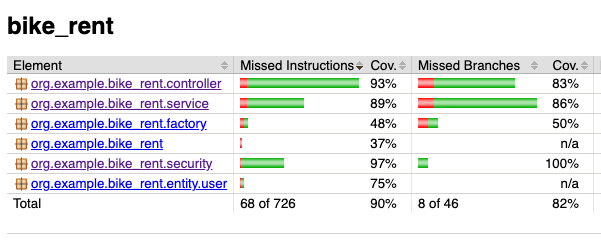
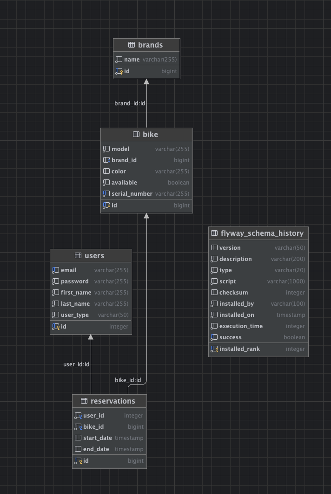
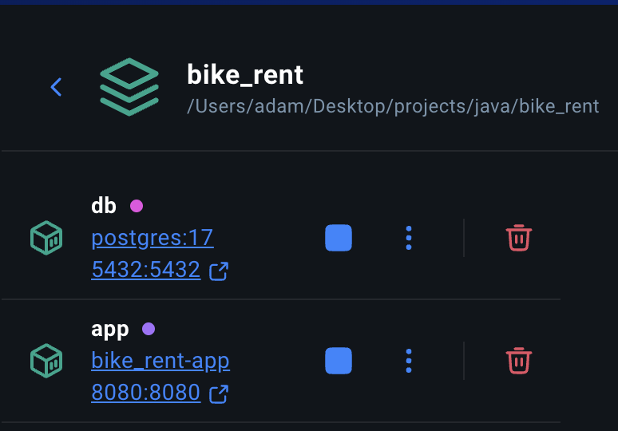
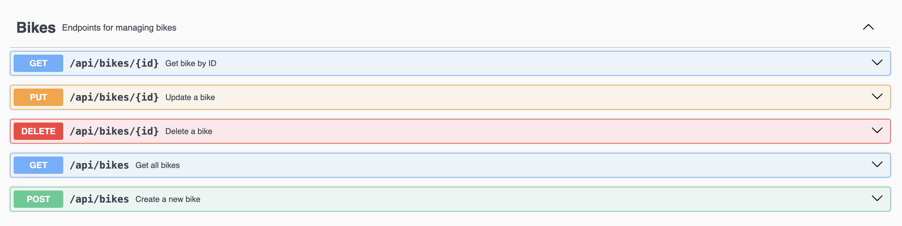
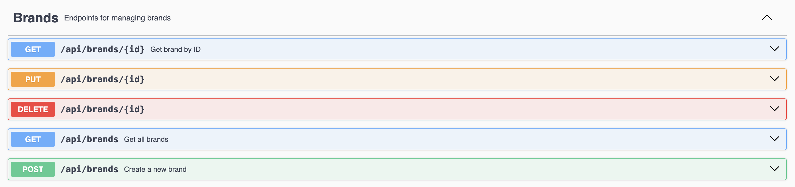
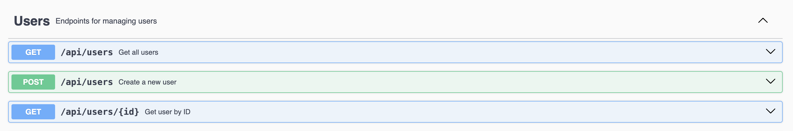
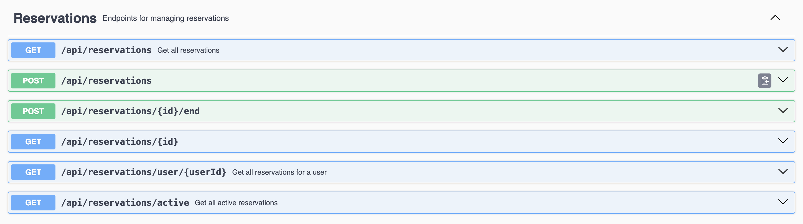

# Bike Rent
### Autor: Adam Mąka 152693

Bike Rent to aplikacja webowa służąca do zarządzania wypożyczalnią rowerów.

## 1. Technologie
- Java 17, Maven
- Spring Boot (REST API i Spring Security)
- Hibernate + PostgreSQL (Docker)
- Flyway do migracji bazy danych
- Testy JUnit + MockMvc
- Swagger UI dla dokumentacji API
- Docker

## 2. Autentykacja i autoryzacja
Autentykacja i autoryzacja w projekcie realizowane są za pomocą Spring Security z bazą użytkowników (H2 w testach, PostgreSQL w produkcji). Role użytkowników (`CUSTOMER`, `ADMIN`) definiują dostęp do poszczególnych endpointów (RBAC).
- `ADMIN` może zarządzać użytkownikami, markami rowerów i rezerwacjami.
- `CUSTOMER` może tworzyć nowe rezerwacje i kończyć własne rezerwacje.

## 3. Funkcjonalności
- Role Based Access Control (RBAC) – role `CUSTOMER` i `ADMIN`
- Operacje CRUD
- Zarządzanie użytkownikami (tylko przez administratora)
- Tworzenie i przeglądanie rezerwacji:
    - `CUSTOMER` tworzy nowe rezerwacje i kończy własne (`/api/reservations`)
    - `ADMIN` przegląda wszystkie rezerwacje i rezerwacje innych użytkowników
- Automatyczne migracje bazy danych przy starcie aplikacji (Flyway)
- Testy jednostkowe i integracyjne (JUnit, MockMvc) pokrywające minimum 80% kodu
- Interaktywna dokumentacja API za pomocą Swagger UI
- Uruchomienie w kontenerach Docker z bazą PostgreSQL

## 4. Struktura projektu
```
src/main/java/com/example/bike_rent/controller - Kontrollery REST API
src/main/java/com/example/bike_rent/entity - Encje
src/main/java/com/example/bike_rent/repository - Repozytoria do wyciągania danych z bazy
src/main/java/com/example/bike_rent/service - Serwisy
src/main/java/com/example/bike_rent/security - Konfiguracja security, logowanie użytkowników
src/main/java/com/example/bike_rent/factory - Fabryka do tworzenia instancji obiektów

src/main/resources/db/migration - Migracje bazy danych

src/test/java/org/example/bike_rent - Testy jednostkowe i integracyjne

pom.xml - konfiguracja zależności aplikacji
docker-compose.yml oraz Dockerfile - konfiguracja uruchomienia aplikacji i bazy w kontenerach Docker
```

## 5. Pokrycie testów


## 6. Diagram ERD bazy danych


## 7. Kontenery docker


## 8. Dokumentacja API




